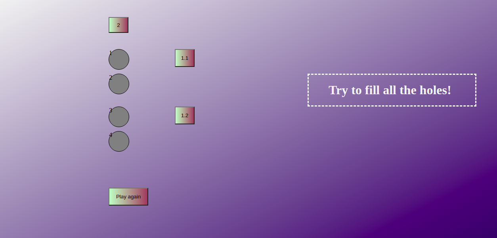

# Push it level 3

An imitation of the game Push it!-level 3 

<h4>Rules</h4>
<ul>
<li>Numbers on buttons indicate how many spaces they will fill</li>
<li>If a space is already filled by the button directed to the y-axis, the buttons directed to x-axis won't work </li>
</ul>

The game can be played <a href="https://muratcan-yuksel.github.io/Push-it-3/">here </a>  

